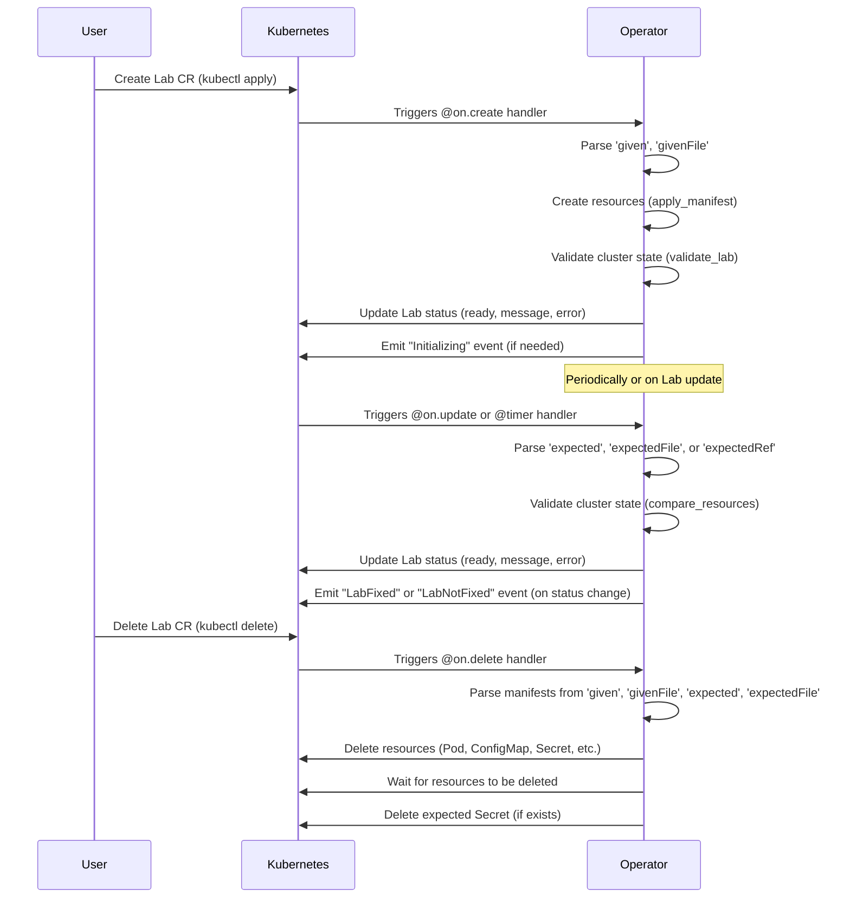

# Kubernetes Lab Operator

This operator helps run **Kubernetes lab exercises** by applying given manifests and validating expected cluster state.

---

## How to run it locally using Minikube and Python

You can run the operator directly on your machine, connected to a Minikube cluster.

### Prerequisites

* Minikube installed and running ([https://minikube.sigs.k8s.io/docs/start/](https://minikube.sigs.k8s.io/docs/start/))
* `kubectl` configured to talk to your Minikube cluster
* Python 3.8+
* Operator dependencies:
  * `kopf==1.36.1`
  * `kubernetes==28.1.0`
  * `PyYAML==6.0.1`

### Steps

1. **Start Minikube**

    ```bash
    minikube start
    ```

2. **Make sure your local `kubectl` points to Minikube**

    ```bash
    kubectl config current-context  # should show minikube
    ```

3. **Install required Python dependencies**

    ```bash
    pip install kopf==1.36.1 kubernetes==28.1.0 PyYAML==6.0.1
    ```

4. **Deploy the CRD**

    ```bash
    kubectl apply -f crds/lab.yaml
    ```

5. **Run the operator Python script with `kopf`**

    ```bash
    kopf run labs-operator.py
    ```

    * This will start the operator locally.
    * It will watch for `Lab` resources on your Minikube cluster.
    * Any changes to the operator code will require restarting this command.

6. **Create and apply a Lab resource**

    You can now use either inline YAML or reference external YAML files for the `given` and `expected` fields.

    **Example using inline YAML:**
    ```yaml
    apiVersion: training.dev/v1
    kind: Lab
    metadata:
      name: example-lab
    spec:
      given: |
        apiVersion: v1
        kind: Pod
        metadata:
          name: busybox
          namespace: default
        spec:
          containers:
          - name: busybox-lab
            image: busybox
            command: ["sleep", "3600"]
      expected: |
        apiVersion: v1
        kind: Pod
        metadata:
          name: busybox
          namespace: default
        spec:
          containers:
          - name: busybox
            image: busybox
            command: ["sleep", "3600"]
    ```

    **Example using external YAML files:**
    ```yaml
    apiVersion: training.dev/v1
    kind: Lab
    metadata:
      name: example-lab-from-file
    spec:
      givenFile: example-labs/given.yaml
      expectedFile: example-labs/expected.yaml
    ```

    Save as `example-labs/example-lab.yaml` and apply:

    ```bash
    kubectl apply -f example-labs/example-lab.yaml
    ```

---

## Features

- Supports both inline YAML (`given`, `expected`) and referencing external YAML files (`givenFile`, `expectedFile`) for lab definitions.
- Applies resources in `spec.given` or from `spec.givenFile` to the cluster.
- Converts `spec.expected` or `spec.expectedFile` to a Secret and patches the Lab to use `expectedRef` (to prevent exposing the solution directly to the user and ensure consistent handling).
- Verifies the live cluster state matches the expected manifests (using a subset/deep comparison, ignoring extra fields set by Kubernetes).
- Updates `.status.ready`, `.status.message`, and `.status.error` accordingly.
- Emits Kubernetes events:
  * **While initializing:** "Please wait, the Lab is initializing and preparing resources."
  * **When fixed:** "The Lab is successfully fixed."
  * **When not fixed:** "The cluster state does not match the expected manifests. Keep looking for the issue and try again."
- When the Lab is deleted, all resources from `given`/`givenFile` and `expected`/`expectedFile` are deleted, including the operator-created Secret.

---

## How it works



---

## Troubleshooting

* Inspect Lab status and events:

    ```bash
    kubectl describe lab example-lab
    ```

    Look for:
    - **Status:** `.status.ready`, `.status.message`, `.status.error`
    - **Events:** For initialization, success, or mismatch hints

### Notes

* The operator uses in-cluster config by default, but falls back to your local kubeconfig if run outside a cluster.
* You don’t need Docker or container rebuilds in this mode.
* Just create/update `Lab` CRs via `kubectl` as usual; the locally running operator will reconcile them.
* The `given`, `givenFile`, `expected`, and `expectedFile` blocks are supported for flexible lab definitions.

---